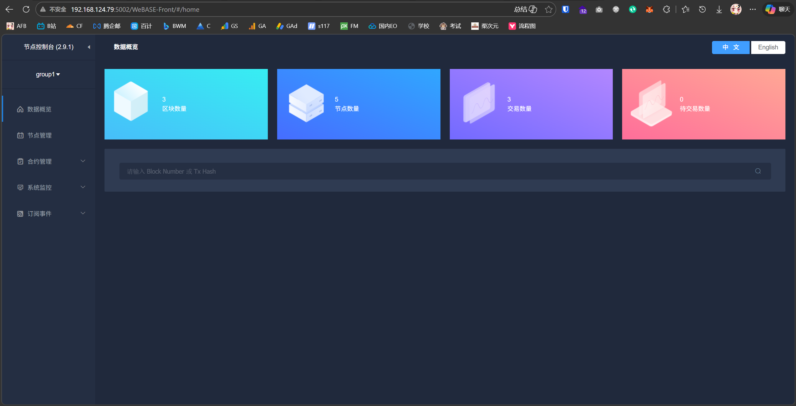
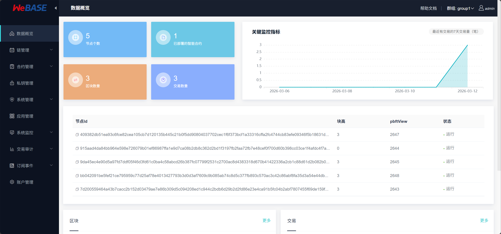

# 前言

- OS：Ubuntu 20.04.6
- 基础目录：/root

解压Tools.zip
```bash
unzip tools.zip
```

# 配置Java 8
```bash
tar -xzvf jdk-8u181-linux-x64.tar.gz
```

更改目录名称为jdk8
```bash
mv jdk1.8.0_181/ jdk8
```

写入环境变量
```bash
echo -e 'export JAVA_HOME=/root/jdk8\nexport PATH=$JAVA_HOME/bin:$PATH' >> /etc/profile
```

重载环境变量
```bash
source /etc/profile
```

查看Java版本
```bash
java -version
```


# 在127.0.0.1上搭建一个4节点单链

解压Fisco-BCOS二进制文件
```bash
tar -xzvf fisco-bcos.tar.gz
```

搭建链
```bash
bash build_chain.sh -l 127.0.0.1:4 -p 30300,20200,8545 -e ./fisco-bcos
```

启动所有节点
```bash
bash nodes/127.0.0.1/start_all.sh
```

查询节点进程
```bash
ps -ef | grep fisco-bcos
```

查询节点日志
```bash
tail -f nodes/127.0.0.1/node0/log/* | grep connected
```

查询节点共识
```bash
tail -f nodes/127.0.0.1/node0/log/* | grep +++
```


### 扩容一个新的节点
```bash
bash gen_node_cert.sh -c nodes/cert/agency -o nodes/127.0.0.1/node4
```

- `-c` 指定所属的机构证书路径
- `-o` 指定新节点所属目录

复制证书至新的节点
```bash
cp nodes/127.0.0.1/node0/*.sh nodes/127.0.0.1/node4
```

复制节点配置文件至新的节点
```bash
cp nodes/127.0.0.1/node0/config.ini nodes/127.0.0.1/node4
```

复制群组配置文件至新的节点
```bash
cp nodes/127.0.0.1/node0/conf/group.1.* nodes/127.0.0.1/node4/conf
```

编辑节点配置文件
```bash
nano nodes/127.0.0.1/node4/config.ini
```

```ini ins={3,5,9,15}
[rpc]
    channel_listen_ip=0.0.0.0
    channel_listen_port=20204
    jsonrpc_listen_ip=127.0.0.1
    jsonrpc_listen_port=8549
    disable_dynamic_group=false
[p2p]
    listen_ip=0.0.0.0
    listen_port=30304
    ; nodes to connect
    node.0=127.0.0.1:30300
    node.1=127.0.0.1:30301
    node.2=127.0.0.1:30302
    node.3=127.0.0.1:30303
    node.4=127.0.0.1:30304
```

启动节点node4
```bash
bash nodes/127.0.0.1/node4/start.sh
```

查询新增节点的共识和连接状态
```bash
root@af:~# tail -f nodes/127.0.0.1/node4/log/* | grep connected
info|2026-03-12 07:55:19.428643|[P2P][Service] heartBeat,connected count=4
```

# 拉黑节点
以拉黑 `node3` 为例。获取需要拉黑节点的ID
```bash
cat nodes/127.0.0.1/node3/conf/node.nodeid
```

将其复制到node0配置文件的 `blacklist` 块中
```bash
nano nodes/127.0.0.1/node0/config.ini
```

```ini ins={4}
[certificate_blacklist]
    ; crl.0 should be nodeid, nodeid's length is 128
    ;crl.0=
crl.0=915aad4da84bb964e598e726079b01ef86987ffa1e9d7ca08b2db8c362d2bd1f3197fb2faa72fb7e48cef0f700d60b398cc03ce1f4afdc4f7a5635fa24a91d19
```

重启所有节点，查看连接数

```bash
root@af:~# tail -f nodes/127.0.0.1/node0/log/* | grep connected
info|2026-03-12 07:59:59.645999|[P2P][Service] heartBeat,connected count=4
info|2026-03-12 08:06:29.063675|[P2P][Service] heartBeat,connected count=3
info|2026-03-12 08:06:39.074545|[P2P][Service] heartBeat,connected count=3
info|2026-03-12 08:06:49.082355|[P2P][Service] heartBeat,connected count=3
```

可见 `node0` 连接数已变为3

# FISCO-BCOS 控制台

解压
```bash
tar -xzvf console.tar.gz
```

将示例配置文件转换为生产配置文件
```bash
cp console/conf/config-example.toml console/conf/config.toml
```

复制控制台启动需要调用的区块链网络
```bash
cp nodes/127.0.0.1/sdk/* console/conf
```

进入控制台
```bash
bash console/start.sh
```

部署合约。需要记住 `contract address`
```bash
deploy HelloWorld
```

以 `get` 方法调用合约，这里传入 `contract address`
```bash
call HelloWorld 0x1a80ee31f9503afcfd2218fc669bb1a87fe4145c get
```

以 `set` 方法调用合约，需要传入一个字符串
```bash
call HelloWorld 0x1a80ee31f9503afcfd2218fc669bb1a87fe4145c set 'Hello, FISCO!'
```

### 添加共识节点

先获取本群组正在共识的一个列表
```bash
getSealerList
```

再获取 `node4` 节点ID
```bash
cat nodes/127.0.0.1/node4/conf/node.nodeid
```

最后通过控制台添加共识
```bash
addSealer 7d200559464a43b7cacc2b152d03479ae7e86b309d5c094208ed1c944c2bdb6d29b2d2fd86e23e4ca91b5fc04b2abf7807455f69de159f7be13059f0d37d4994
```

# 搭建WeBase-Front
从 `webase` 目录将压缩包复制到工作目录
```bash
cp webase/webase-front.zip .
```

解压
```bash
unzip webase-front.zip
```

复制节点sdk到webase-front中
```bash
cp nodes/127.0.0.1/sdk/* webase-front/conf/
```

进入webase目录
```bash
cd webase-front/
```

启动
```bash
bash start.sh
```

前往
```bash
http://192.168.124.79:5002/WeBASE-Front/#/home
```



# 搭建WeBase

安装mariadb（MySQL Linux兼容）
```bash
apt install mariadb-server
```

连接MySQL
```bash
mysql
```

给 `root@localhost` 用户设置密码
```bash
ALTER USER 'root'@'localhost'
IDENTIFIED BY '123456';
```

安装 PIP
```bash
apt install python3-pip
```

安装 PyMySQL PIP包
```bash
pip install PyMySQL
```

解压 `webase-deploy.zip`
```bash
unzip webase-deploy.zip
```

将其余zip复制到 `webase-deploy` 目录
```bash
cp *.zip webase-deploy
```

删除多余的zip
```bash
rm webase-deploy/webase-deploy.zip
```

编辑`common.properties` 
```bash
nano webase-deploy/common.properties
```

编辑 MySQL 配置
```ini ins={4,5,11,12}
# Mysql database configuration of WeBASE-Node-Manager
mysql.ip=localhost
mysql.port=3306
mysql.user=root
mysql.password=123456
mysql.database=webasenodemanager

# Mysql database configuration of WeBASE-Sign
sign.mysql.ip=localhost
sign.mysql.port=3306
sign.mysql.user=root
sign.mysql.password=123456
sign.mysql.database=webasesign
```

继续修改：若存在Fisco，则使用现有链
```ini ins={2}
# Use existing chain or not (yes/no)
if.exist.fisco=yes
```

继续修改，设置本地Fisco路径
```ini ins={5}
### if using exited chain, [if.exist.fisco=yes]
# The path of the existing chain, the path of the start_all.sh script
# Under the path, there should be a 'sdk' directory where the SDK certificates (ca.crt, sdk.crt, no>
fisco.dir=/root/nodes/127.0.0.1
# Node directory in [fisco.dir] for WeBASE-Front to connect
# example: 'node.dir=node0' would auto change to '/data/app/nodes/127.0.0.1/node0'
# Under the path, there is a conf directory where node certificates (ca.crt, node.crt and node.key)>
node.dir=node0
```

重新启动我们之前搭建过的节点
```bash
bash nodes/127.0.0.1/start_all.sh
```

正式安装。默认会从网络拉取依赖包，这些我们都有，直接回车执行默认的 `no` 即可
```bash
python3 deploy.py installAll
```

前往
```bash
http://192.168.124.79:5000/#/login
```

管理员账号：
```bash
admin
```

管理员密码：
```bash
Abcd1234
```




# 多群组节点

新建 `node5`
```bash
bash gen_node_cert.sh -c nodes/cert/agency/ -o nodes/127.0.0.1/node5
```

克隆快捷脚本
```bash
cp nodes/127.0.0.1/node0/*.sh nodes/127.0.0.1/node5
```

克隆配置文件
```bash
cp nodes/127.0.0.1/node0/config.ini nodes/127.0.0.1/node5
```

编辑节点配置文件
```ini ins={3,5,9,15}
[rpc]
    channel_listen_ip=0.0.0.0
    channel_listen_port=20205
    jsonrpc_listen_ip=127.0.0.1
    jsonrpc_listen_port=8550
    disable_dynamic_group=false
[p2p]
    listen_ip=0.0.0.0
    listen_port=30305
    ; nodes to connect
    node.0=127.0.0.1:30300
    node.1=127.0.0.1:30301
    node.2=127.0.0.1:30302
    node.3=127.0.0.1:30303
    node.5=127.0.0.1:30305
```

编辑控制台配置文件
```bash
nano console/conf/config.toml
```

```ini ins={2}
[network]
peers=["127.0.0.1:20200", "127.0.0.1:20201", "127.0.0.1:20205"]    # The peer list to connect
```

获取当前Unix时间戳
```bash
date +%s%3N
```

获取 `node5` ID
```bash
cat nodes/127.0.0.1/node5/conf/node.nodeid
```

启动所有节点
```bash
bash nodes/127.0.0.1/start_all.sh
```

启动控制台
```bash
bash console/start.sh
```

创建群组2
```bash
generateGroup 127.0.0.1:20205 2 1773308632547 cb420b749f02a9ef943901555f242759b4d780b7ff6d73beb27129f0cedaa8950c12c4217f5b142cec8ed90cff7214bccd8fbecbf1759d8b1a44aeb8c0d47319
```

启动群组2
```bash
startGroup 127.0.0.1:20205 2
```

# 测试合约

下载Nodejs V8
```bash
wget https://nodejs.org/dist/v8.17.0/node-v8.17.0-linux-x64.tar.gz
```

解压
```bash
tar -xzvf node-v8.17.0-linux-x64.tar.gz
```

更改目录名
```bash
mv node-v8.17.0-linux-x64 node8
```

设置环境变量
```bash
echo -e 'export NODE_HOME=/root/node8\nexport PATH=$NODE_HOME/bin:$PATH' >> /etc/profile
```

重载环境变量
```bash
source /etc/profile
```

查看Node版本
```bash
node -v
```

查看Docker版本
```bash
docker -v
```

查看Docker Compose版本
```bash
docker-compose -v
```

通过Docker加载镜像
```bash
docker load < /root/solc_0.4.25.tar
```

启动镜像
```bash
docker run ethereum/solc:0.4.25 solc --version
```

解压 `caliper.rar`
```bash
unrar x caliper.rar
```

进入 `caliper` 目录
```bash
cd caliper
```

使用NPM镜像源
```bash
npm config set registry https://registry.npmmirror.com
```

安装环境
```bash
npm install --only=prod @hyperledger/caliper-cli@0.2.0
```

修改证书路径
```bash
nano /root/caliper/networks/fisco-bcos/test-nw/fisco-bcos.json
```

```json ins={2-4}
"authentication": {
                "key": "/root/nodes/127.0.0.1/sdk/sdk.key",
                "cert": "/root/nodes/127.0.0.1/sdk/sdk.crt",
                "ca": "/root/nodes/127.0.0.1/sdk/ca.crt"
```

启动链
```bash
bash /root/nodes/127.0.0.1/start_all.sh
```

执行测试脚本，有测试输出即为正确
```bash
npx caliper benchmark run --caliper-benchconfig benchmarks/samples/fisco-bcos/trace/config.yaml --caliper-networkconfig networks/fisco-bcos/test-nw/fisco-bcos.json
```

